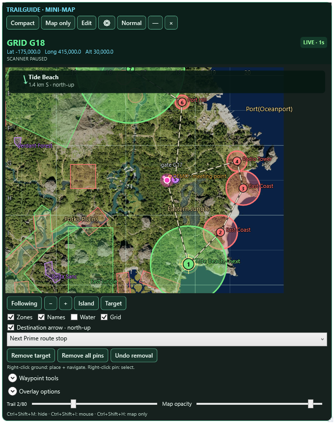
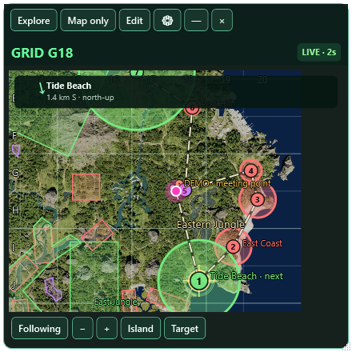
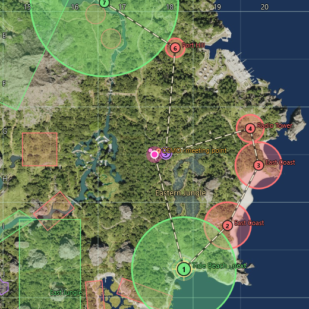
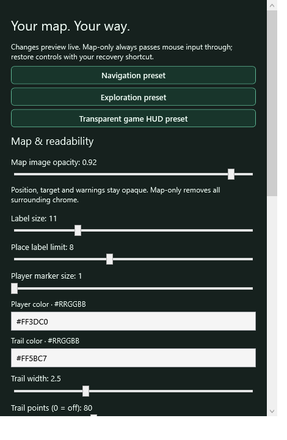
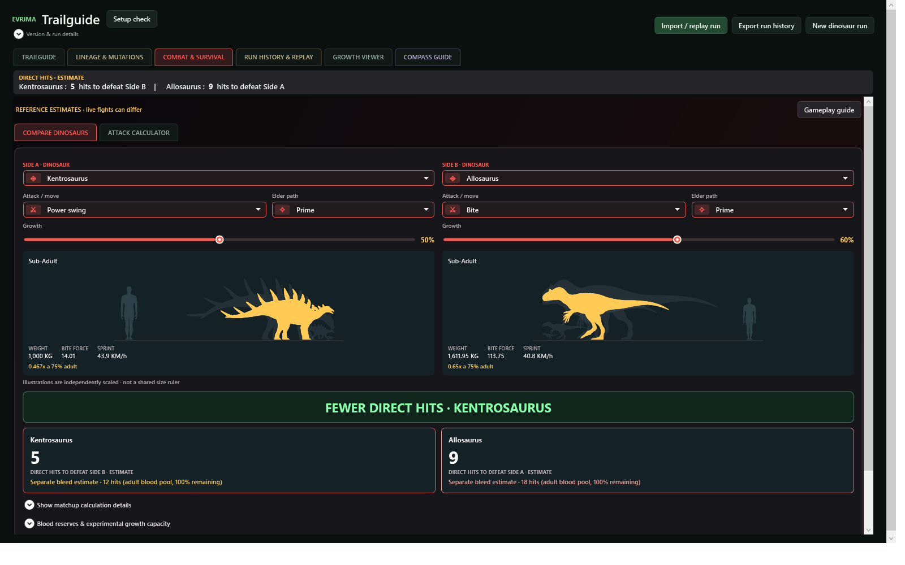
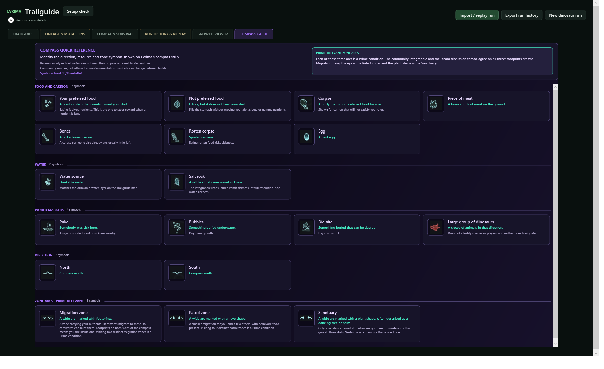
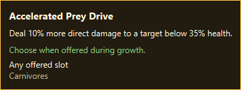
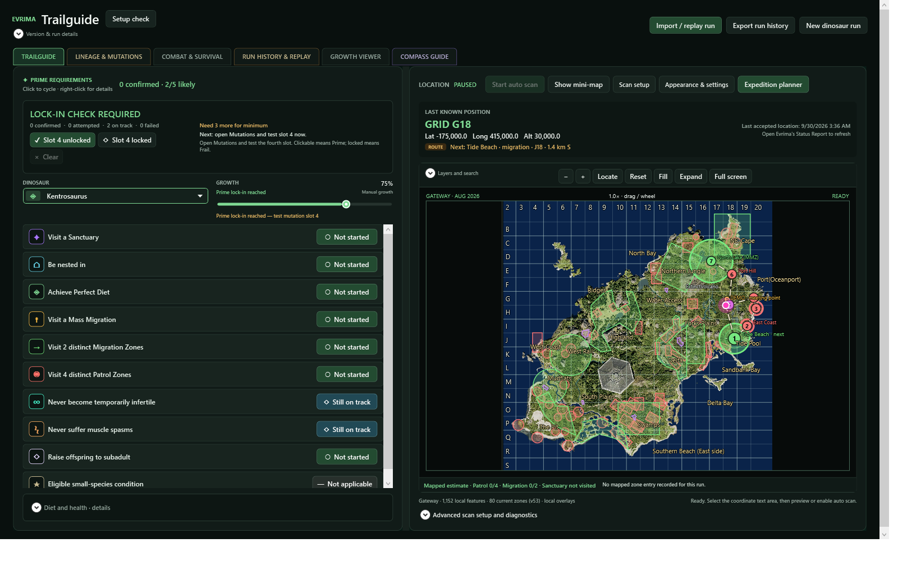
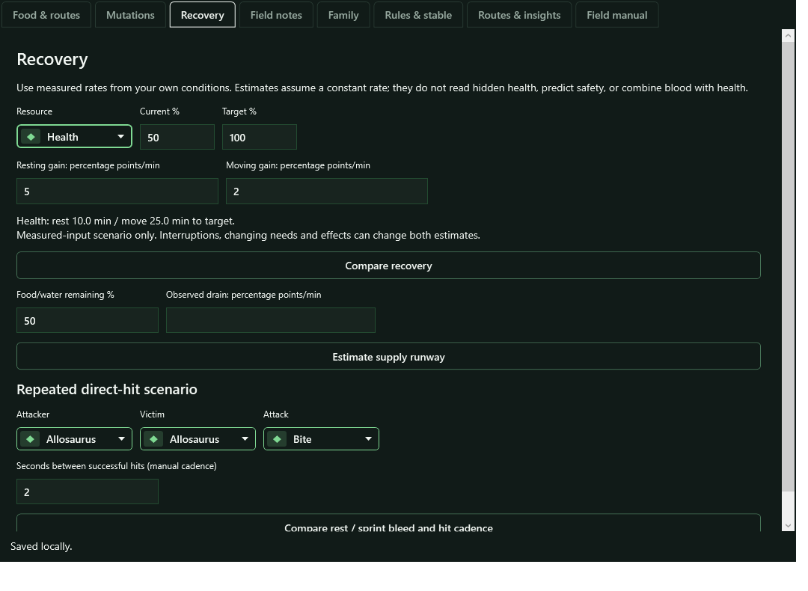

# Evrima Trailguide

## Your map. Your way. Your next move.

**Find your bearings. Plan your next stop. Compare your next matchup.**

A free Windows companion for **The Isle: Evrima**, made by **Roid**. Bring your own location, Prime checklist, waypoint routes and combat references into one workspace—then take just the map with you.

[What's new](https://github.com/roid-apps/Evrima-Trailguide/releases/tag/v1.25.1) · [Full walkthrough](https://youtu.be/U__SdPqlwzQ) · [Quick introduction](https://youtube.com/shorts/b4B2yn6n7Ws) · [Report a bug](https://github.com/roid-apps/Evrima-Trailguide/issues)

**1.25.1 is the latest stable release.** It brings the Expedition and visual-combat preview features into the stable channel, with a focused pass on mini-map customization, tracking reliability and compact layouts. These are actual app screenshots using isolated sample profiles—not live gameplay or somebody else's saved run.

## Your map. Your way.

Keep the essentials close without keeping the whole dashboard open. Follow accepted location updates, choose a destination, and switch between exploration, compact navigation and map-only.

<table>
<tr><th>Explore</th><th>Navigate</th><th>Just the map</th></tr>
<tr>
<td width="34%"></td>
<td width="33%"></td>
<td width="33%"></td>
</tr>
<tr><td>Manage layers, pins and routes.</td><td>Keep navigation small and readable.</td><td>Hide the controls. Keep game input passing through.</td></tr>
</table>

- **Map-only is now automatically passive:** click-through, no mouse activation and no resize-edge interception. Use **Ctrl+Shift+I** to return to interactive controls.
- **Follow your next stop:** auto-centering on accepted readings, resume-follow, north-up destination guidance and off-screen target indicators.
- **Make a plan:** named waypoint itineraries, category filters, pin search, waypoint-file sharing and undo removal.
- **Make it yours:** map-image opacity, player size/color, trail color/width, label size/density and independent zone visibility/fill. Markers, guidance and warnings remain opaque.
- **Save your setup:** Navigation, Exploration and transparent game-HUD presets, plus up to eight named personal layouts. Reset appearance without rebuilding your route.
- **Stay informed:** compact stale-location badges and explicit clock warnings. Confirmed relocations start a new trail segment instead of drawing a fictional journey across the island.
- **Keep moving:** previous/next saved-route stops and restored route progress; an optional automatic interaction lock when returning to the game.

<strong>New: a dedicated customization editor with live preview</strong>

Open the gear button or **Overlay options**. Adjust your map in a separate scrolling editor without squeezing the map out of view. Compact mode deliberately caps place labels to reduce clutter. Map-only removes the surrounding chrome; map-image opacity ranges from 10–100% while navigation remains visible.

Location updates require your coordinates to be visible in the in-game Status Report. This is **self-location**, not hidden-player tracking. Guidance is map-relative—not your dinosaur's facing direction or terrain-safe pathfinding. Borderless/windowed play is intended; live-game input and physical mixed-DPI combinations still need broader testing. Transparent screenshots are shown against the page background, not composited into gameplay.

## See the matchup, not a wall of text

Choose the dinosaurs and their attacks. Move either growth slider to update its illustration, stats and estimates together. The refreshed workspace brings **inputs, silhouettes and results forward**, with advanced conditions and explanations tucked into expandable sections.

- Separate **Compare dinosaurs** and **Attack calculator** workspaces.
- Independent mutation loadouts and conditions for each side.
- Direct-hit and bleed estimates kept separate, with optional blood-reserve scenarios.
- Practical combat, bleed, diet, water and survival guidance.
- Reference limitations retained without putting internal technical details in the main workflow.

**These are reference estimates, not a fight-winner prediction.** Artwork panels are independently scaled, not a shared size ruler. Attack cadence, armor, positioning, reflection, regeneration and special mechanics are not universally simulated. Experimental growth-based blood capacity is optional and off by default; unknown effects stay unknown.

## Plan the whole expedition

**Trailguide → Expedition planner** gathers your between-fights planning tools:

| Tool | What you can do |
| --- | --- |
| Food & routes | Browse species food references, search resource locations and combine resource stops with a Prime itinerary. |
| Mutation workshop | Save build plans, track manual progress and compare a plan with your current lineage. |
| Recovery & supplies | Compare rest/move scenarios and food/water runway using rates you measured yourself. |
| Field notes | Record expiring observations, crossings, hazards, cover and rest spots. |
| Family & lineage journal | Keep nesting goals, milestones, reminders and manually recorded server/lineage notes together. |
| Routes & insights | Export offline, phone-friendly route cards and inspect recorded-sample density. |

Plans and observations are local. Reference foods are **not live food detection**. Routes connect stops, not terrain-safe paths. A lineage journal cannot save or restore an in-game dinosaur; measured recovery scenarios are not universal survival timers.

## Small changes that make a difference

**Aligned compass cards. Mutation descriptions before you choose.** Hover a mutation in the selector to read its effect, acquisition guidance and restrictions without changing your selection.

Cleaner lineage and replay layouts, more compact reading status, searchable history and clearer separate combat controls make the rest of the app easier to use too.

<strong>Explore the full dashboard and recovery tools</strong>

Prime evidence tracking, map search, run replay, growth references, complete profile backups and seven daily recovery snapshots are included. Restore previews apply on the next launch; manual and pre-restore backups are kept separately. Exported profiles and route cards can contain your private routes and notes—share intentionally.

## Download and get started

1. **Back up your complete profile** before upgrading. Close Trailguide before installing.
2. [Download the Windows x64 installer](https://github.com/roid-apps/Evrima-Trailguide/releases/download/v1.25.1/EvrimaTrailguide-Setup-1.25.1.exe). Run the EXE—not GitHub's automatic source archives. [ZIP bundle](https://github.com/roid-apps/Evrima-Trailguide/releases/download/v1.25.1/EvrimaTrailguide-1.25.1-Windows.zip) is the same installer plus notices, **not a portable app**.
3. Open **Setup check**, then Evrima's **Status Report**. Choose **Scan setup → Auto setup areas**, and check the previews.
4. Start scanning and choose **Show mini-map**. Reopen the Status Report whenever you need to refresh your position.

**Windows x64 · Windows 10 build 19041+ · .NET runtime included.** English Windows OCR support may need enabling separately. Normal upgrades retain per-user settings and history. Back up before downgrading: old versions do not understand every new field.

**Default hotkeys:** `Ctrl+Shift+M` show/hide · `Ctrl+Shift+I` interactive controls · `Ctrl+Shift+H` map-only. Customize them in Overlay options; the main window provides recovery if a hotkey conflicts.

The videos introduce the core workflow and predate this update. The app's optional update check follows GitHub's latest **stable** release. Version 1.25.1 is also detected as newer by the older preview's update checker.

## Validation, privacy and trust

**824 automated tests passed.** Native mini-map, combat, expedition, compass, tooltip and layout checks passed. New regression probes cover moving relocation, sparse outliers, scan-loop ownership, independent opacity, personal layouts and preview-to-stable updates. See the exact-build report below for installer verification and remaining test limits.

[Exact-build validation](https://github.com/roid-apps/Evrima-Trailguide/releases/download/v1.25.1/VALIDATION-v1.25.1.txt) · [SHA-256 checksums](https://github.com/roid-apps/Evrima-Trailguide/releases/download/v1.25.1/SHA256SUMS.txt) · [Privacy statement](PRIVACY.md)

The installer is **unsigned**, so Windows may show an unfamiliar-app/SmartScreen warning. Reputation warnings are not themselves malware findings; signing/reputation and detection results are different checks. No new Microsoft analyst certification, clean-machine test or universal live-game compatibility is claimed. Physical mixed-DPI changes and extended live-game sessions remain unverified on this build. Keep Windows protection enabled.

Trailguide reads your own visible screen information locally. It does not read game memory, inject code, reveal hidden players or automate gameplay. Optional update checks contact GitHub; profile data is not uploaded. Follow your server's companion-tool rules.

## Made by Roid

Have an idea or found a rough edge? [Open an issue](https://github.com/roid-apps/Evrima-Trailguide/issues) with your version, steps and display setup. Review screenshots for private information before sharing.

**Discord:** r_o_i_d · **Email:** b_greenspan@yahoo.com

Independent fan project, not affiliated with or endorsed by The Isle's developers. Third-party artwork/data credits are included with the installer. This repository hosts downloads and documentation, **not the private application source**.
